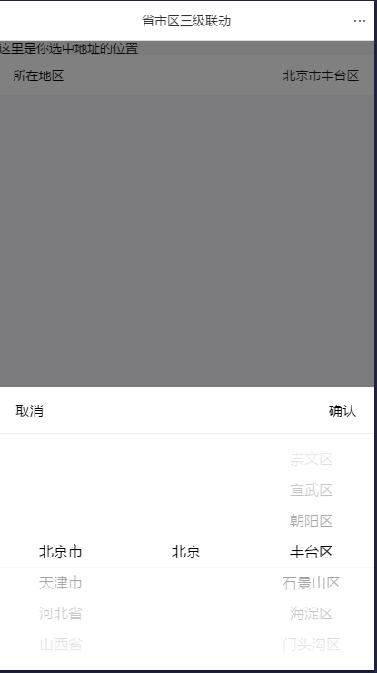

# 支付宝小程序
个人作品：小程序模板，目前有省市区地址三级联动，后期慢慢添加，欢迎优化建议

****
	
|Author|nyeee|
|---|---
|E-mail|karin.chen@qq.com

****
## 目录
* [省市区](#省市区)
* [未添加](#未添加)

___
## 省市区
- ### 页面效果
如图
  

- ### 模板
模板目录：template\cascade
模板包含弹窗蒙层就布局和样式，数据和事件写在pages页面中  

- ### pages下的页面引入
#### pages\addr\addr.axml
    
     <!-- 模板 -->
    <import src="../../template/cascade/cascade.axml"/>
    <template is="cascade" data="{{...addrData}}" />
    
###### *import 路径按页面相对修改；is="cascade" 是模板名称，不可修改；data="{{...addrData}}" 是省市区、事件等数据，可修改  *
#### pages\addr\addr.acss
    
     @import '../../template/cascade/cascade.acss';
        
import 路径按页面相对修改；
这里将模板的样式引入到页面，如果你想改写一个样式，可以在文件内写同名样式，将自动覆盖这个引入样式；如果想重新写样式，就不引入  
#### pages\addr\addr.js
    
     所有代码和效果都在这里实现
        
 *顶部把全国地址数据导入，如果是用请求的方式导入数据，可以在onLoad(){}里面写请求，如果数据结构和我不同，模板里面的市区的for遍历后也要修改*
> import { cityData } from '../../data/addrList' // 默认数据

 *在pages.data里面写需要的数据*
> data: {  
>  // 地址三联动-数据  
>  addrData: {  
>   addrPicker: false,//省市区联动-蒙层：显示隐藏  
>   sheng: [],// 省数据表   
>   shi: [],// 市数据表  
>   qu: [],//区  
>   provincename: '',// 最后选中的省  
>   cityname: '',// 市  
>   areaname: '',// 区  
>   value: [0, 0, 0],// 索引值:显示被选中的  
>   cancel: 'showADDR',//取消事件  
>   confirm: 'confirmADDR',//确定按钮事件  
>   citychange: 'ChangeADDR',// 改变数据  
>  },  
> },

 *写上相关的事件*
> intProvinces() {},  intADDR() {},  showADDR() {},confirmADDR(){},ChangeADDR(){}
 
  
   
___
## 未添加

